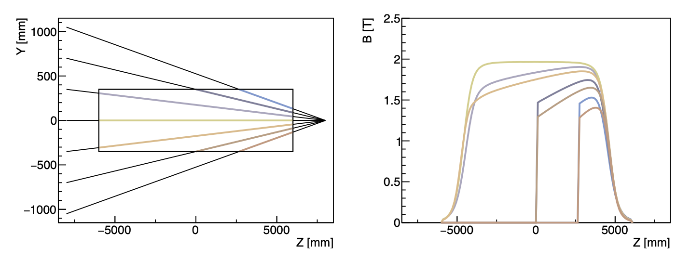
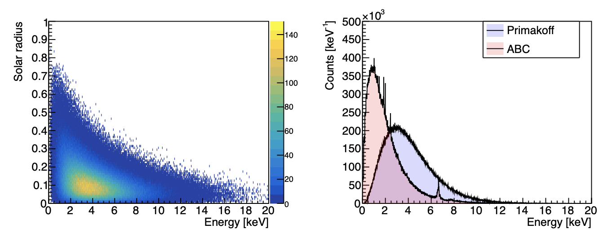
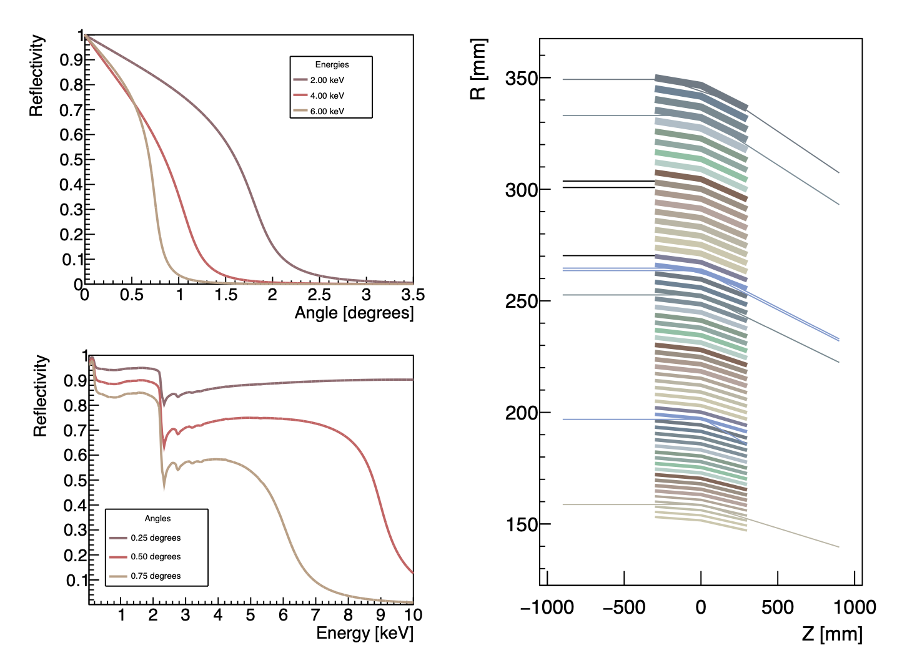
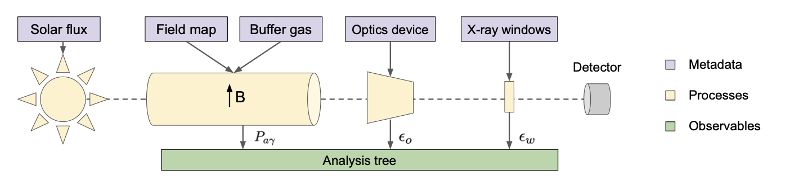
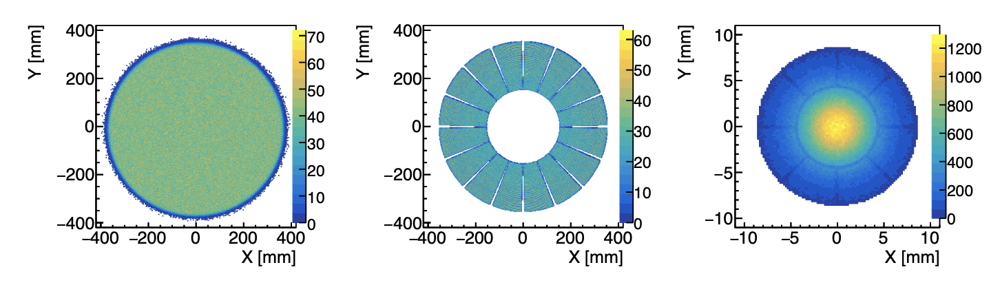
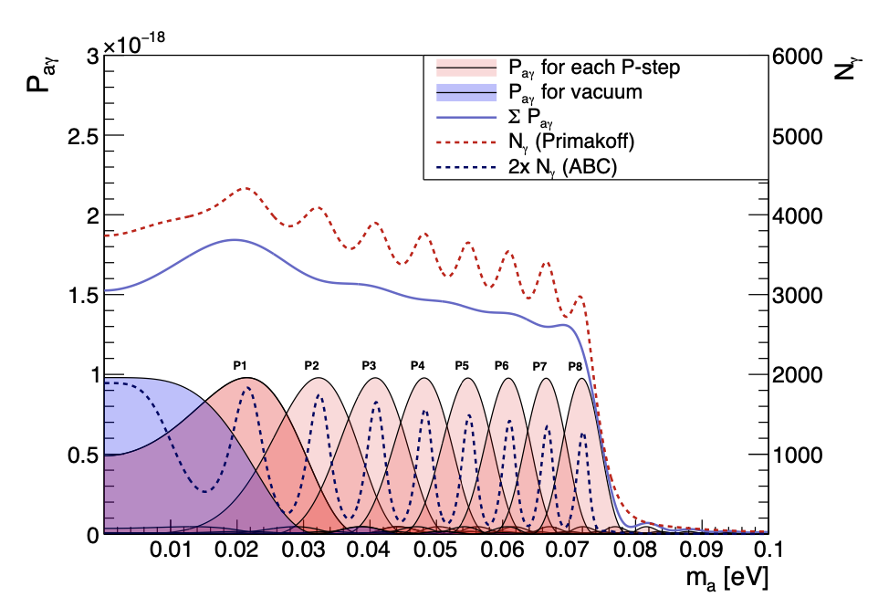
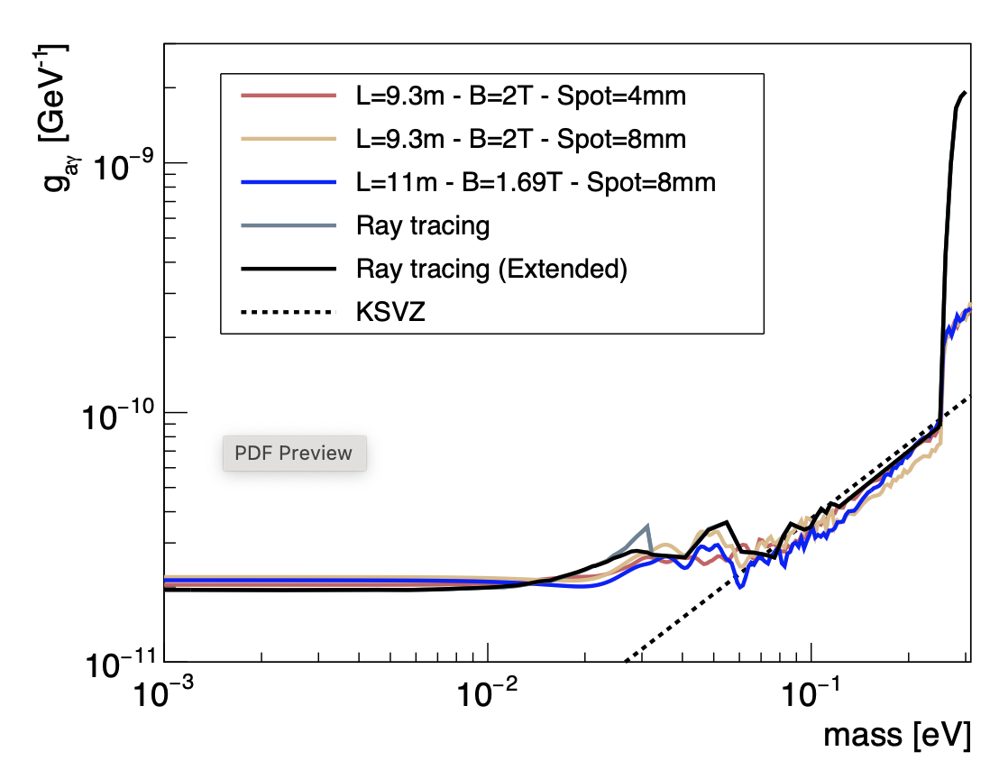
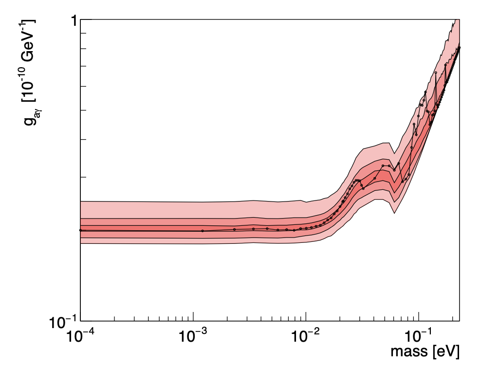

[](https://rest-for-physics.github.io)
[](https://sultan.unizar.es/rest/)
[](https://rest-forum.unizar.es/)
[](https://github.com/rest-for-physics/axionlib/commits/master)

**Framework DOI:** [](https://doi.org/10.5281/zenodo.7156324)

**Library DOI:** [](https://doi.org/10.5281/zenodo.7415788)


This is a REST-for-Physics library used to generate solar axions and obtain the detection probability function. The library allows to define a generic helioscope setup - buffer gas, magnetic field, optics response, photon transmission - through dedicated REST-for-Physics metadata definitions found in this library.

This library is distributed together with the REST-for-Physics framework as a submodule. In order to use it within the framework it is necessary to pull the library submodule. The main user website guide, at the [downloads page](https://rest-for-physics.github.io/downloading.html), will provide accurate instructions on how to download the axionlib and other modules. In short, the following recipe should pull the latest official version:

```
cd rest-framework
python3 pull-submodules.py --onlylibs
```

### Prerequisites

As any REST library, this library requires a running installion of REST-for-Physics Framework. But on top of that, some calculations require higher precision arithmetics and we need to use a external library named `mpfr`.

All you need to be able to compile `axionlib` is to install the [mpfr](https://www.mpfr.org) library. Download the source, compile, and install.  Usually as simple as running `./configure`, `make` and `make install` at the downloaded source directory.

#### mpfr installation:

If you are using Debian distribution or Debian based Linux distribution, executing `sudo apt install libmpfr-dev` should be enough to install the required mpfr library.

##### Manual installation

Download the file `mpfr-4.1.0.tar.gz` from the following [site](https://www.mpfr.org/mpfr-current/#download) compile and install executing the following commands.

```
wget https://www.mpfr.org/mpfr-current/mpfr-4.1.0.tar.gz
tar -zxvf mpfr-4.1.0.tar.gz
cd mpfr-4.1.0/
./configure
make
sudo make install (to do a system installation)
```

### RestAxionLib installation

Once you have all the prerequisites installed you need to add the library at the REST-for-Physics framework compilation stage. Go to the main framework build directory and add the axion library as a compilation option.

```
cd framework/build
cmake -DRESTLIB_AXION=ON -DREST_MPFR=ON ../
make -j4 install
```

If you have installed MPFR from source you may need to specify the path where the installation files are located at the `cmake` stage:

```
cd framework/build
cmake -DRESTLIB_AXION=ON -DREST_MPFR=ON -DMPFR_PATH=/full/path/to/mpfr/ ../
make -j4 install
```

In case of problems it is recommended to have a look at the following complete [download](https://rest-for-physics.github.io/downloading.html) and [installation](https://rest-for-physics.github.io/installation) instructions.

It is necessary to enable the `REST_MPFR` cmake option in order to benefit from the MPFR routines integration. If not, classes that use MPFR will not be compiled. `REST_MPFR` might be optionally disabled in case MPFR libraries are not available. However, this will lead to a non-complete installation of axionlib.

### Publications

This repository makes use of the following published codes:

- K. Altenmuller et al, REST-for-Physics, a ROOT-based framework for event oriented data analysis and combined Monte Carlo response, [Computer Physics Communications 273, April 2022, 108281](https://doi.org/10.1016/j.cpc.2021.108281).
- S.Hoof, J.Jaeckel, T.J.Lennert, Quantifying uncertainties in the solar axion flux and their impact on determining axion model parameters, [JCAP09(2021)006](https://doi.org/10.1088/1475-7516/2021/09/006).
- T.Kittelmann, E.Klinkby, E.B.Knudsen, P.Willendrup, X.X.Cai, K.Kanaki, Monte Carlo Particle Lists: MCPL, Computer Physics Communications 218 (2017) 17–42](http://dx.doi.org/10.17632/cby92vsv5g.1).

### Gallery









