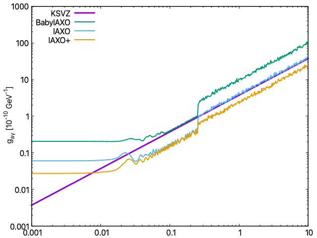

This example is used to reproduce the different scenarios considered inside the "E. Armengaud et al JCAP06(2019)047, Physics Potential of the International Axion Observatory". Those scenarios are summarized in the following table.

Parameter | Units   | BabyIAXO | IAXO baseline | IAXO upgraded |
  :---:   |  :---:  |  :---:   |     :---:     |      :---:    |
B         |   $T$     |   ~1.73     |     ~2.55      |      ~3.57     |
L         |   $m$     |   10     |      20       |       22      |
A         |  $m^2$     |  0.77    |      2.3      |       3.9     |
 --       |        --  |      --  |            --  |           --  |
b            | $keV^{-1}cm^{-2}s^{-1}$ | $1\times10^{-7}$ | $1\times 10^{-8}$ | $1\times10^{-9}$ |
$\epsilon_d$ |         |   0.7      |      0.8     |     0.8      |
$\epsilon_o$ |         |   0.35      |      0.7      |     0.7       |
a            | $cm^2$  |  2 x 0.3    |    8 x 0.15   |   8 x 0.15    |
$\epsilon_t$ |         |   0.5       |      0.5      |     0.5       |
t            | $year$    |   1.5+1.5       |      3+3      |    5+5      |
 File       |     |     BabyIAXO.rml  |  IAXO.rml  |  IAXOPlus.rml  |

We consider a tracking of 12 hours which is why we define $\epsilon_t$ efficiency equal to 0.5. The magnetic field considered is obtained from the $f_M$ divided by $L^2 A$ from the table found in the original publication. The macro `GenerateSignalComponents.C` will produce a set of continuous density settings covering masses up to 0.25\,eV, which translates into 73 density settings.

## Vacuum sensitivity curve generation

```
restRoot
[0] TRestSensitivity sens("BabyIAXO.rml", "VacuumPhase");
[1] sens.GenerateCurve()
[2] sens.ExportCurve("limits/BabyIAXO_Vacuum.csv", 0 )
```
## Combined vacuum and gas phase sensitivity curve generation

We need first to pre-generate the signals for the different density settings.

```
restRoot
[0] .L GenerateSignalComponents.C
[1] GenerateSignalComponents( "BabyIAXO.rml", "GasSignal" );
```

The exposure times at each density setting are adjusted to follow the KSVZ line trend. It is `GenerateSignalComponents.C` the responsible to perform this calculation and to create a `settings` file that will define the exposure times, and the corresponding TRestComponent signal, that will be also generated by this macro for each density setting, and stored in a ROOT file.

The `GenerateSignalComponents` macro defines a default total exposure time that will be distributed between the different density settings. For example, in order to generate the signals and settings file for IAXO we would need to specify that the gas phase takes in total 5 years of 300days and 12 hours, and express it in seconds.

```
restRoot
[0] .L GenerateSignalComponents.C
[1] GenerateSignalComponents( "BabyIAXO.rml", "GasSignal", 5, 5, 1.66 );
```

The two last arguments specify the number of steps (5) that will equaly share the exposure time (1.66). The remaining density settings will share the remaining exposure time following a KSVZ trend.

For the scenarios given in this example (BabyIAXO/IAXO/IAXOPlus) we have used:

```
GenerateSignalComponents("BabyIAXO.rml", "GasSignal", 1.5, 5, 0.5 );
GenerateSignalComponents("IAXO.rml", "GasSignal", 3, 5, 1 );
GenerateSignalComponents("IAXOPlus.rml", "GasSignal", 5, 5, 1.66 );
```

The first density setting will be skipped since it exceeds the total time required to reach the KSVZ line. We may also change the number of skipped settings. Then, inside `TRestSensitivity` we define an experiment list, the `settings` file with a column which the calculated exposure time, and the signal to be used, with a common background defined inside <TRestSensitibvity>.

```
[0] TRestSensitivity sens("BabyIAXO.rml", "CombinedPhase");
[1] sens.GenerateCurve()
[2] sens.ExportCurve("limits/BabyIAXO_Combined.csv", 0 )
```

### Detector response

A detailed detector x-ray response could be considered by adding the pre-calculated response constructed using [restG4](https://github.com/rest-for-physics/restG4/tree/master), see example [14.DetectorResponse](https://github.com/rest-for-physics/restG4/tree/master/examples/14.DetectorResponse).The pre-calculated response matrix will be convoluted with the axion energy spectrum resulting in a calculation that is 150 times (number of reponse matrix bins) more expensive. The detector response will be considered in the sensitivity calculation if we include a `<TRestResponse>` section inside `<TRestAxionHelioscopeSignal>`, for example for a Xenon-Neon based mixture at 1.4 bar we would add:

```
<TRestResponse name="XenonNeon" variable="energy" filename="XenonNeon_50Pct_1.4bar.N150f" />
```

**Hints**
- The number of parameter nodes, mass values at which the signal is calculated is of the order of 500 points, which will lead to a HD curve. Reducing the number of points by increasing the parameter `stepParameterValue` will also reduce the computational cost.
- The parameter `useAverage` has been enabled for all examples, meaning that the tracking mock MonteCarlo data will be generated using exactly the average number of background counts, thus representing an average experiment but not a realistic data taking program. Still good enough to present prospects. A more complete exclusion could be achieved by disabling the `useAverage` parameter and generating several sensitivity curves, using `TRestSensitivity::GenerateCurves(N)` and then drawing them using `TRestSensitivity::DrawLevelCurves`.
- We are using here the Primakoff flux for the calculation, but obviously just replacing the `TRestAxionQCDSolarFlux` by the corresponding definition would allow to get limit to e.g. the ABC electron coupling flux.

### Results

The limits directory contains the sensitivity results obtained with each of the TRestSensitivity definitions defined in this example. It also contains a `.gp` file to reproduce the plot shown here.



### Credit

Consider citing any of the following publications:

- E. Armengaud et al JCAP06(2019)047, Physics Potential of the International Axion Observatory".
- Javier Galan, Johanna von Oy, Kresimir Jakovcic, Francisco Rodríguez Candón, Juan Antonio García, Luis Antonio Obis Aparicio, Sebastian Smith, Konrad Altenmüller, Louis Helary, Tomas O'Shea. (2024). rest-for-physics/axionlib: v2.4 (v2.4). Zenodo. https://doi.org/10.5281/zenodo.11110335
