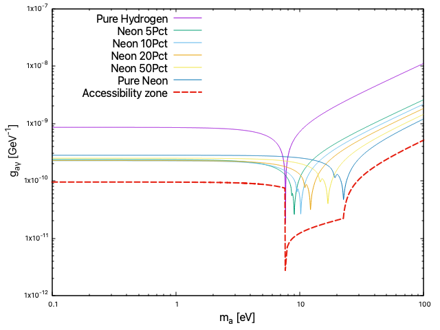

In this example we reproduce the sensitivity of ....

## Quick recipe to this example

Edit the value of `NeFraction` inside the `CMS.rml` in order to generate curves with a different fraction of Neon inside a Hydrogen-Neon mixture.

Then for each curve, in a new `restRoot` session we do:
```
[0] TRestSensitivity sens("CMS.rml", "CMS");
[1] sens.GenerateCurve()
[2] sens.ExportCurve("limits/CMSLimit.csv", 0 )
```

### Results

The limits directory contains the sensitivity results obtained with each of the TRestSensitivity definition defined in this example, after applying the corresponding `NeonFraction`. It also contains a `.gp` file to reproduce the plot shown here.



The `ZeroBck.csv` can be reproduced using the macros provided in example `05.RawSensitivity`.

### Credit

Consider citing any of the following publications:

- Javier Galan, Johanna von Oy, Kresimir Jakovcic, Francisco Rodríguez Candón, Juan Antonio García, Luis Antonio Obis Aparicio, Sebastian Smith, Konrad Altenmüller, Louis Helary, Tomas O'Shea. (2024). rest-for-physics/axionlib: v2.4 (v2.4). Zenodo. https://doi.org/10.5281/zenodo.11110335
